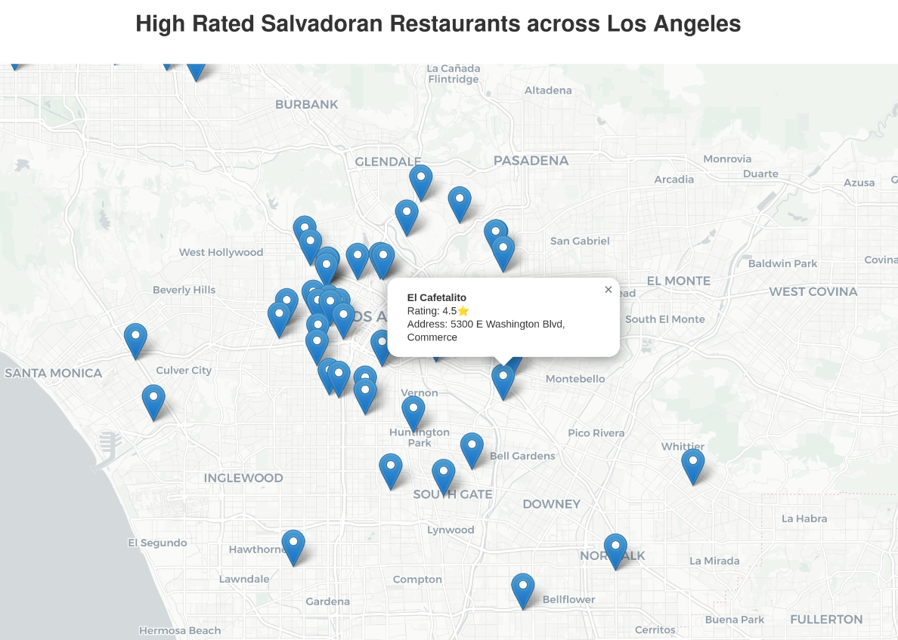

# High-Rated Salvadoran Restaurants in Los Angeles



An automated data pipeline that discovers, filters, and visualizes high-rated Salvadoran restaurants across Los Angeles using Google Places API and interactive mapping.

## 🗺️ Live Demo

The pipeline generates an interactive map showing 4.5+ star Salvadoran restaurants across LA, with detailed popups containing restaurant information, ratings, and addresses.

## 🚀 Features

- **Comprehensive Search**: Searches 10 major LA areas with multiple Salvadoran-related keywords
- **Data Quality Validation**: Automatic validation of restaurant ratings and data integrity  
- **Interactive Visualization**: Clean, responsive map with restaurant details and ratings
- **Automated Pipeline**: Single command execution with dependency checking and error handling

## 📁 Project Structure

```
├── allareas.py                          # Data collection from Google Places API
├── rating.py                            # Data filtering and quality validation
├── map_markers.py                       # Interactive map generation using Folium
├── run.py                               # Master pipeline orchestrator
├── requirements.txt                     # Python dependencies
├── high_salvadoran_restaurants_la.png   # Sample map screenshot
└── README.md                            # Project documentation
```

## 🛠️ Installation

1. **Clone the repository**
   ```bash
   git clone <your-repo-url>
   cd salvadoran-restaurants-la
   ```

2. **Install dependencies**
   ```bash
   pip install -r requirements.txt
   ```

3. **Set up Google Places API**
   - Get a Google Places API key from [Google Cloud Console](https://console.cloud.google.com/)
   - Create a `.env` file in the project root:
     ```
     GOOGLE_PLACES_API_KEY=your_api_key_here
     ```

## 🏃‍♂️ Usage

### Quick Start (Recommended)
```bash
python run.py
```

This runs the complete pipeline and generates all output files.

### Manual Step-by-Step
```bash
# Step 1: Collect restaurant data
python allareas.py

# Step 2: Filter and validate data  
python rating.py

# Step 3: Generate interactive map
python map_markers.py
```

## 📊 Pipeline Stages

### 1. Data Collection (`allareas.py`)
- Searches 10 LA areas: Downtown, Hollywood, Beverly Hills, Santa Monica, etc.
- Uses 5 keywords: salvadoran, pupusas, pupuseria, salvadorean, pulgarsito
- Handles API pagination (up to 60 results per search)
- Deduplicates results using place_id
- **Output**: `unfiltered_rating_restaurants.csv`

### 2. Data Filtering (`rating.py`)
- Validates rating values (1-5 scale)
- Filters for high-quality restaurants (4.5+ stars)
- Reports data quality statistics
- **Output**: `filtered_rating_restaurants.csv`

### 3. Map Generation (`map_markers.py`)
- Creates interactive Folium map centered on LA
- Uses clean CartoDB Positron tiles
- Adds markers with restaurant details and ratings
- Generates responsive HTML visualization
- **Output**: `high_salvadoran_restaurants_la.html`

## 🔧 Configuration

### Search Areas
Modify the `la_areas` list in `allareas.py` to change search locations:
```python
la_areas = [
    ('Area Name', 'latitude,longitude'),
    # Add more areas...
]
```

### Search Keywords  
Update the `keywords` list in `allareas.py`:
```python
keywords = ['salvadoran', 'pupusas', 'pupuseria']
```

### Rating Threshold
Change the minimum rating in `rating.py`:
```python
filtered_rating = df[df['rating'] >= 4.5]  # Adjust threshold here
```

## 📋 Output Files

- `unfiltered_rating_restaurants.csv` - Raw restaurant data from Google Places
- `filtered_rating_restaurants.csv` - High-rated restaurants only (4.5+ stars)
- `high_salvadoran_restaurants_la.html` - Interactive map (open in browser)

## 🔒 Privacy & API Usage

- **No sensitive data**: Only public restaurant information is collected
- **API rate limiting**: Includes proper delays between API requests
- **Cost awareness**: Searches are optimized to minimize API calls
- **Data retention**: Only stores essential restaurant metadata

## 🛡️ Error Handling

The pipeline includes comprehensive error handling:
- API key validation
- Network request failures with retries
- File existence checking
- Data quality validation
- Graceful failure with informative error messages

## 📈 Extending the Pipeline

### Add New Cuisines
1. Modify `keywords` list in `allareas.py`
2. Update map title in `map_markers.py`
3. Adjust rating threshold if needed

### Different Cities
1. Update `la_areas` coordinates in `allareas.py`
2. Modify map title and zoom level in `map_markers.py`

### Additional Data Fields
1. Add fields to the data extraction in `allareas.py`
2. Update popup template in `map_markers.py`

## 🤝 Contributing

Contributions are welcome! Please feel free to submit a Pull Request. For major changes, please open an issue first to discuss what you would like to change.

---

**Note**: This project requires a Google Places API key. API usage may incur costs depending on the number of requests. Please review Google's pricing before running large-scale searches.